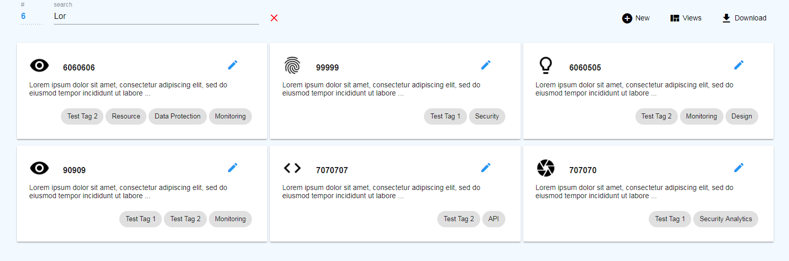
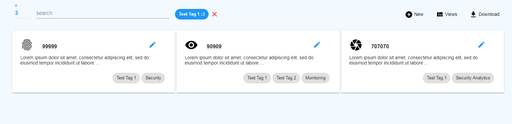
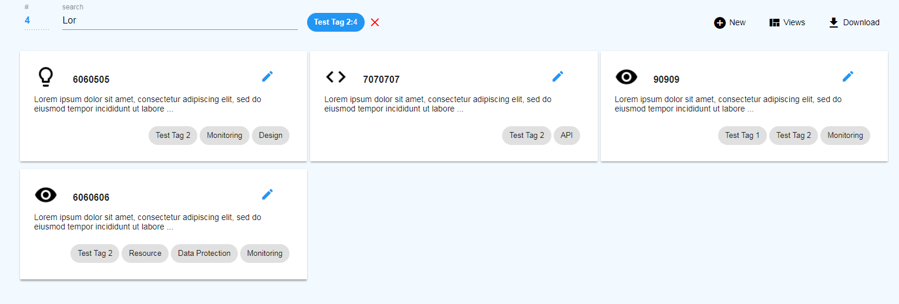

# Dual Search
The dual search takes in a string (via user input), and tags (selectable by the user on the displayed page), and does a double filter, displaying all requirements that contain the selected tags, as well as the requirements that contain the user string. 

This search has allowed users to almost instantly locate the subset of requirements they are looking for, which can be quickly viewed, modified, exported, etc.

The non-functional sample I have provided consists of three distinct files:
* card-view.component.html
    * One of many components that leverage the dual search 
    *  Emplasis on line 3 
        `*ngFor="let item of (items | tag: tags) | search:searchTerm"`
        * This line iterates on the provided items, filters by tags, then filters by the provided search text 
* search.pipe.ts
    * Search by string functionality 
         * returns a list of requirments that contain the search parameter
* tags.pipe.ts
    * Search by ennumerable (list of shared tags / requirements / etc.) 
        *   returns a list of requirments that contain the selected tags 

# Examples

# Links
https://www.onap.org/